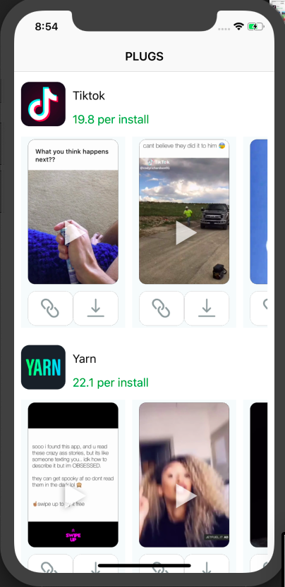
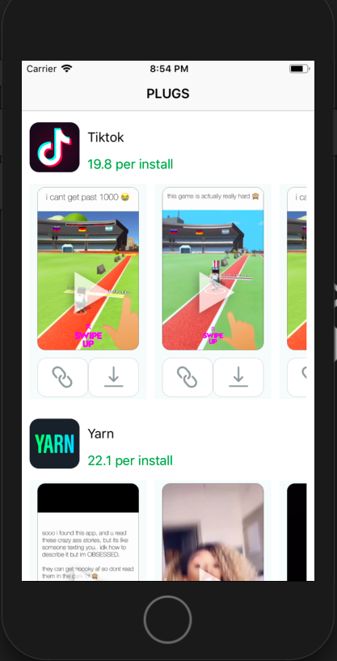
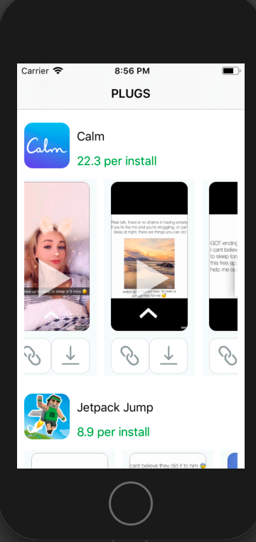

# TakeHome-iOS-challenge
</img>
</img>
</img>

### Overview 

This repository contains the challenge code for Jetfuel iOS Engineer position. Repo's contains should only be used by managers and engineers from @Jetfuel for assessment purposes.

### Time

- 13 to 14 accumulated hours

### Getting Started

Run these commands to have the full project ready on your local machine.

`` git clone https://github.com/MediBoss/TakeHome-iOS-challenge.git``

`` cd JetfuelTakeHome/JetfuelTakeHome``

`` pod install `` to get all dependencies. Run `` $ sudo gem install cocoapods `` if you don't have cocoapod installed.

### Built with

* Swift 5.0 - Main language
* Xcode 10.0 - Main IDE
* SDWebImage - Image downloading & caching


### File/Folder Architecture

I followed the MVC architecure for this project. 
```
root/
|
|
|-- JetfuelTakeHome/
        |-- JetfuelTakeHome
                |-- Model              
                |-- View                    
                |-- Controller             
                |-- Networking  
                |-- Supporting Files
                |-- Extensions               
                |-- Info.plist          
        |-- Podfile
        |-- .gitignore
        |-- Podfile.lock  
|
|-- Screenshots/                                                   
|-- README.md                          

```

### Challenges

* Playing video of selected media since the URL had tokens in it
* Laying out the two buttons(link & cell) with proper assets and right resolution
